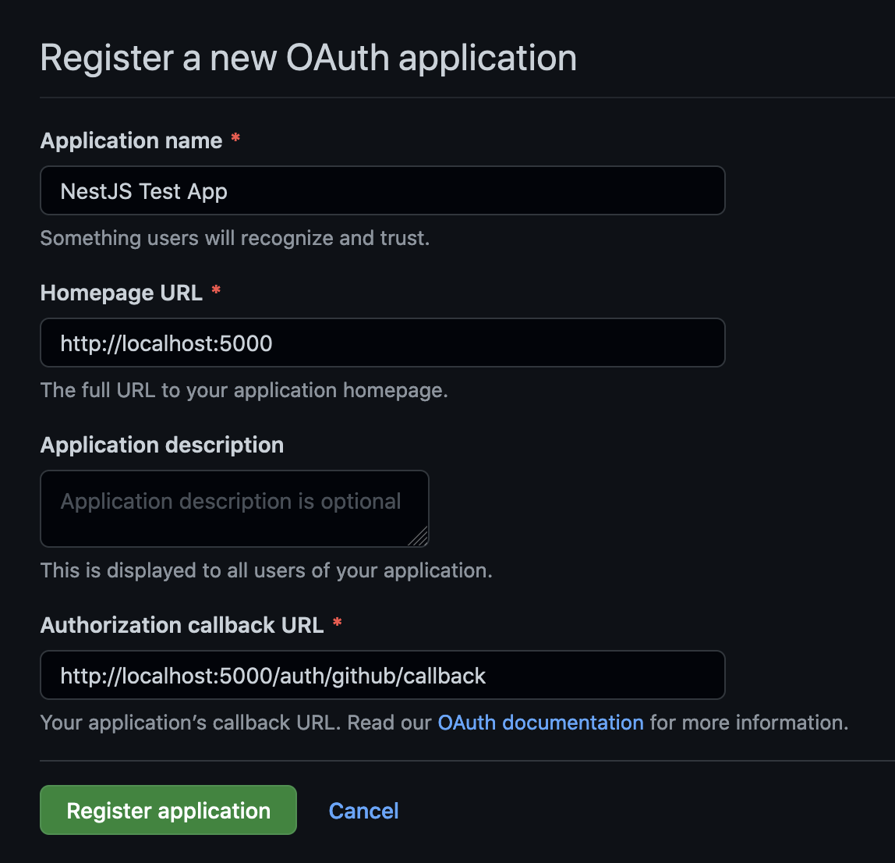

# OAuth2 in NestJS for Social Login with GitHub (and Google, Facebook, …)

This sample NestJS app is one of the kind you get with `nest new`, but with the addition of [Passport](https://www.passportjs.org/) to

-   authenticate a user by identity token issued from GitHub as an Identity Provider,
-   manage authenticated state (by issuing a JSON Web Token, JWT),
-   attach information about the authenticated user to the `Request` object for further use in route handlers.

It is easy to add another [strategy](https://www.passportjs.org/packages/) or replace GitHub with Google or Facebook for instance.

The code has many comments that make everything very clear and understandable.

## Run

First you have to [register](https://github.com/settings/applications/new) a new OAuth application in GitHub:



Then copy file `.env.sample` and name it `.env`. Open `.env` and fill the values of `GITHUB_OAUTH_CLIENT_ID` and `GITHUB_OAUTH_CLIENT_SECRET` according to the application just created in GitHub. Also set an arbitrary value for `JWT_SECRET`.

Then you can start the app with

```sh
$ npm run dev
```

In your browser, open [http://localhost:5000](http://localhost:5000) or [http://localhost:5000/profile](http://localhost:5000/profile). You will get HTTP status 401 "Unauthorized" because these are protected routes that are accessible only to requests that contain a valid JWT.

So open [http://localhost:5000/auth/github](http://localhost:5000/auth/github). This route allows users to authenticate via GitHub, returning a JWT for use in subsequent calls to protected API endpoints. The JWT is included in the response body and as a cookie named **jwt**. Because of the cookie, you are now able to visit [http://localhost:5000](http://localhost:5000) and [http://localhost:5000/profile](http://localhost:5000/profile).

Protection is realized by annotating the routes with `@UseGuards(JwtAuthGuard)`: When such a route is hit, the Guard will automatically invoke our passport-jwt custom configured logic, validating the JWT, and assigning the `user` property to the `Request` object. Clients can send the JWT either

-   as a bearer token in an authorization header (`"Authorization: Bearer eyJhbGciO…"`) or
-   in a cookie (name "jwt", its value is the token).
